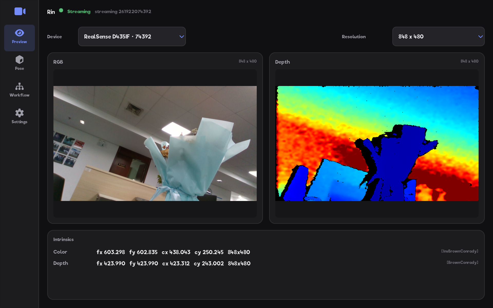
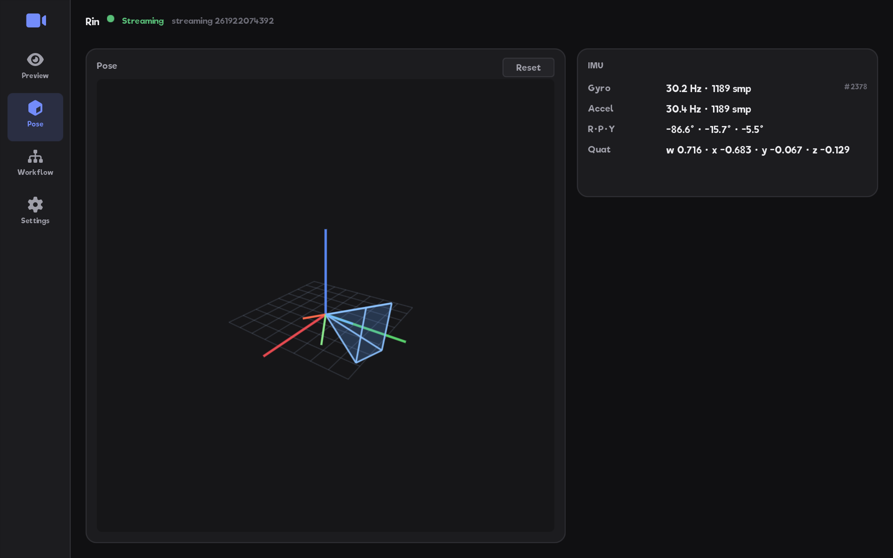
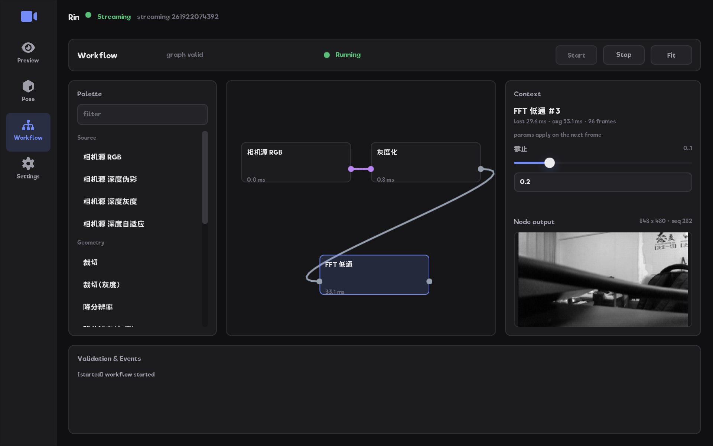

# Rin

[](https://github.com/Linductor-alkaid/rin/actions/workflows/ci.yml)
[](https://github.com/Linductor-alkaid/rin/releases)


[English](README.md) | 简体中文

**Rin** 是一个基于现代 C++ 的 Intel RealSense 实时工作台：RGB/深度实时预览、
IMU 融合驱动的 3D 相机位姿视图，以及拖拽式节点编辑器承载的相机端图像处理——
全部运行在 Executor 承载、显式状态机、经消毒器测试的并发运行时之上。

## 截图

| 预览页 | 3D 位姿视图 |
| --- | --- |
|  |  |
| **工作流——图运行中** | **工作流——节点产物与参数** |
|  |  |

## 功能特性

- **实时预览** —— RGB + 深度双流出流，设备选择、分辨率切换、jet 伪彩/灰度
  深度配色与内参显示。支持热插拔：无设备时应用照常启动（`Waiting` 设计稳态），
  接入后自动恢复出流。
- **3D 位姿视图** —— 固定世界坐标系下实时呈现相机位姿（视锥 + 地面网格），
  加速度计/陀螺仪经 Mahony 互补滤波融合（`ImuFuser`，Core 纯逻辑）；六轴 yaw
  长期漂移作为传感器物理限制如实披露。
- **节点式图像工作流** —— 从调色板拖出节点、连线搭建处理图：裁切、降分辨率、
  自定义卷积核、高斯模糊、直方图均衡、灰度化、FFT 高通/低通/带通，以及深度
  相机源（伪彩/灰度/自适应灰度）与灰度域算子变体。即时校验、按端口类型着色的
  连线、参数热更新（"下一帧生效"）、逐节点产物缩略图与性能面板（端到端 FPS、
  逐节点耗时、显式丢弃计数）；Start/Stop 运行控制，运行中改图呈现"待生效"
  标注。
- **Executor 承载的运行时** —— 全部异步任务、阻塞采集循环与跨线程通道运行在
  pinned executor 库上：队列有界、协作式取消、失败显式成事件、关闭顺序经回归
  测试；无隐藏线程、无 fire-and-forget 任务。
- **当真事一样的测试** —— 状态机/边界/集成测试覆盖 debug/ASan/UBSan/TSan 四
  预设，并有针对真实 D435if 的硬件在环测试。848×480 典型 FFT 链实测吞吐：
  30 fps 相机速率零丢弃（余量约 3.4 倍），见
  [吞吐实测记录](docs/benchmarks/workflow-throughput-848x480.md)。

## 安装（Linux，deb）

从 [Releases](https://github.com/Linductor-alkaid/rin/releases) 下载
`rin_<版本>_amd64.deb`（CI 在每个 `v*` tag 上自动产出，Ubuntu 20.04 容器构建）：

```bash
sudo apt install ./rin_<版本>_amd64.deb
rin
```

deb 自包含：捆绑 pinned 版本的 librealsense2 运行库（`/usr/lib/rin`）与
RealSense udev 规则（安装后免 root 访问设备），无需预装 Intel RealSense
SDK——插上相机即可使用。支持 Ubuntu 20.04（amd64）及以上；打包字体安装在
`/usr/share/rin/fonts/`，无开发布局字体的系统上 UI 也能正确渲染。

## 从源码构建

依赖：CMake ≥ 3.25、Ninja、C++20 编译器（GCC 10+；CI 使用 GCC 12/13），以及
libusb-1.0、libudev、libcurl、OpenGL/X11 开发包。全部第三方库（librealsense2、
executor、EUI-NEO、kissfft）在
[`third_party/dependencies.lock`](third_party/dependencies.lock) 中 pin 到精确
commit，由 CMake 拉取源码构建，无需预装；CI 完整清单见
[ci.yml](.github/workflows/ci.yml)。

```bash
cmake --preset debug            # 或 release / asan / ubsan / tsan
cmake --build build/debug
ctest --test-dir build/debug --output-on-failure
```

硬件测试（标签 `hardware`）需要连接 RealSense 相机，无设备时自动跳过。

构建 deb 安装包：

```bash
cmake --preset release
cmake --build build/release
cmake --build build/release --target package    # 产物位于 build/release/dist/
```

预设选项：`RIN_BUILD_TESTS`（默认 ON）、`RIN_BUILD_VIEWER`（默认 ON）、
`RIN_BUILD_TOOLS`（基准/测量工具，默认 ON）、`RIN_ENABLE_ASAN/UBSAN/TSAN`
（sanitizer 预设自带）。

## 架构

```
apps/viewer (rin)                 EUI-NEO 前端应用——页面导航、节点画布、各面板；
                                  Executor 生命周期 owner（AppRuntime）
src/adapters/realsense            librealsense2 适配器——阻塞采集由 Executor
  (rin_realsense_adapter)         blocking worker 承载；executor::comm 邮箱传递
src/core (rin_core)               相机服务契约（ICameraService）、显式状态机、
                                  像素转换、IMU 融合、图像节点与工作流引擎——
                                  不含任何第三方类型
third_party/executor, eui-neo,    pinned 依赖（configure 时 commit 校验）
  librealsense2, kissfft
```

保持分层的仓库纪律：公开头文件不包含任何第三方类型；Adapter 依赖 Core 接口、
绝不反向；全部并发经 Executor 公开能力，`executor::comm` 通道容量有界；每个
第三方依赖都有独立反馈台账
（[`docs/executor_feedback/`](docs/executor_feedback/ledger.md)、
[`docs/dependency_feedback/`](docs/dependency_feedback/README.md)）。

## 文档

- [工程规范](docs/project/project-standards.md)——规划、验证与提交/MR 纪律
- [实施总计划](docs/plans/rin-implementation-plan.md)与
  [里程碑记录](docs/plans/)（含验收证据）
- [决策记录](docs/decisions/)（ADR 风格）
- [设计文档](docs/design/)——viewer 设计系统、工作台信息架构、图像工作流语义
- [基准测试](docs/benchmarks/)——工作流吞吐实测

## 更新日志

各版本变更见 [CHANGELOG.md](CHANGELOG.md)。
